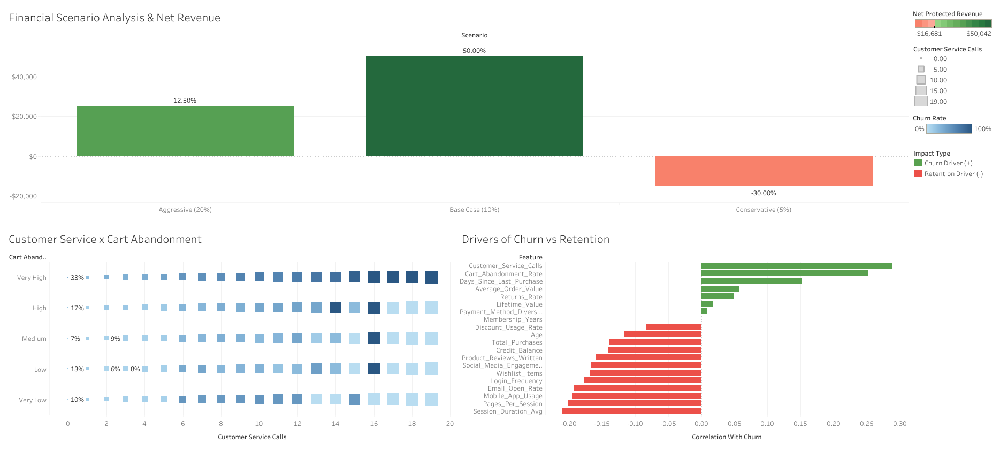
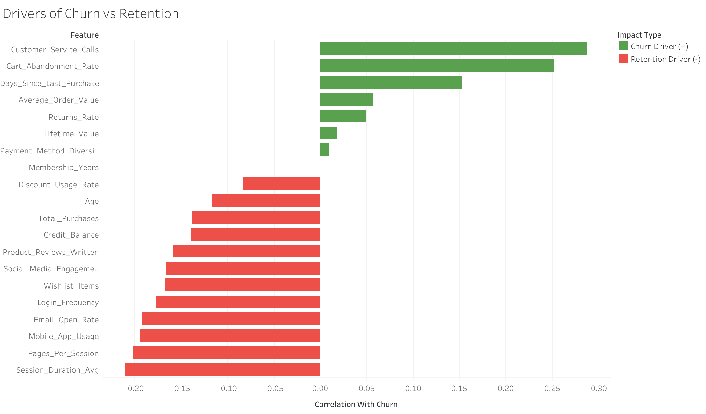
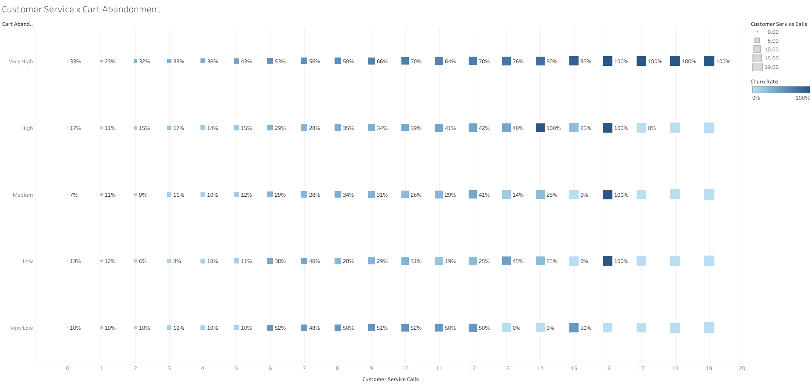
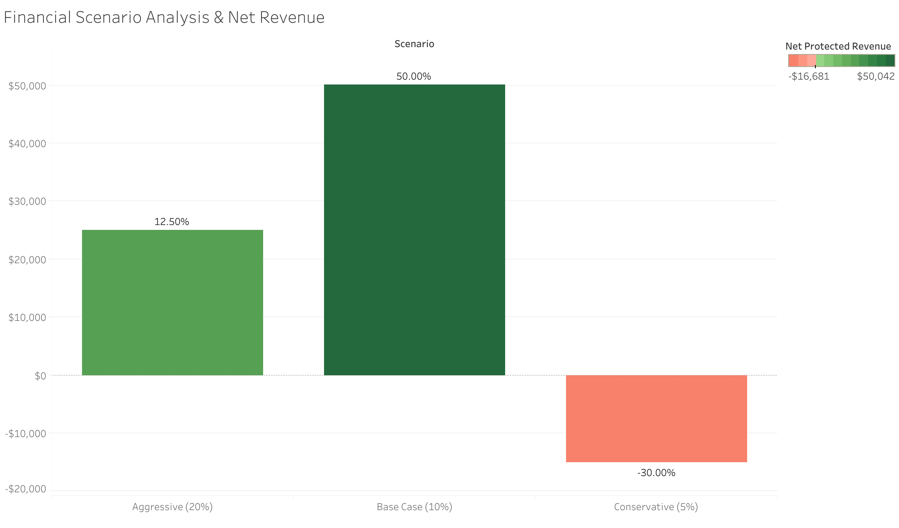

# E-Commerce Churn Analytics & Pricing Strategy: ML Predictive Modeling & Financial LTV Optimization

> 📊 **Interactive Dashboard:** [View Live on Tableau Public](https://public.tableau.com/views/E-CommerceChurnAnalysisCLVStrategy/E-commerceChurnAnalysisCLVStrategy?:language=en-US&publish=yes&:sid=&:redirect=auth&:display_count=n&:origin=viz_share_link)  
> 🛠️ **Tech Stack:** Python (scikit-learn, Pandas, NumPy), Tableau Public (Data Visualization), SQL, GitHub (Repository & Documentation)

---

## Executive Summary

This project evaluates an emerging e-commerce retailer's dataset of **17,983 cleaned transaction records** (filtered from 50,000 raw transaction logs representing $1.0M+ in at-risk Customer Lifetime Value) suffering from silent revenue leakage driven by customer churn. 

Using **Python** and **scikit-learn** for machine learning and economic modeling, an ensemble **Random Forest Classifier** was trained to detect at-risk accounts prior to cancellation. The analytical outputs were exported into **Tableau Public** to build an interactive C-suite dashboard evaluating three promotional discount interventions (**Conservative 5%**, **Base Case 10%**, and **Aggressive 20%**) under price elasticity assumptions to maximize net protected revenue and prevent profit margin erosion.

---

## 1. Machine Learning Performance & Operational Root Cause Analysis

To identify churn risk before account abandonment, a baseline **Logistic Regression** model was benchmarked against a **Random Forest Classifier** trained on an 80/20 stratified split (80% training / 20% out-of-sample testing) to evaluate real-world model generalization and prevent overfitting.

### Model Comparison Matrix

| Model Architecture | Accuracy | Precision (Churn) | Recall (Churn) | F1-Score | ROC-AUC | Strategic Viability |
| :--- | :---: | :---: | :---: | :---: | :---: | :--- |
| **Logistic Regression** | 77.5% | 66.2% | 36.4% | 0.470 | 0.773 | ❌ **Unusable:** Misses 63.6% of at-risk accounts. |
| **Random Forest (Selected)** | **92.2%** | **94.2%** | **76.2%** | **0.843** | **0.922** | ✅ **Optimal:** High precision prevents wasted promo spend. |

---

## 2. Operational Friction & Churn Danger Zone

Feature importance ranking revealed that churn is primarily driven by post-purchase operational friction (`Customer_Service_Calls`: 12.8% importance / +0.288 correlation) and checkout price barriers (`Cart_Abandonment_Rate`: 8.5% importance / +0.251 correlation).

### Friction Matrix Findings
* **The Call #3 Threshold:** Churn risk spikes exponentially once a customer makes 3 or more customer service calls.
* **The Interaction Danger Zone:** Customers in the highest cart-abandonment tier who also reach 3+ support calls approach a **100% churn rate**, identifying a critical operational target for automated intervention.

---

## 3. Financial Sensitivity Analysis & Promotional Scenarios ($1.0M LTV Exposure)

Rather than issuing blanket discounts, the intervention was constrained to **404 High-Value, At-Risk Accounts** (`Churn Probability >= 50%` and `LTV >= Median LTV`), representing **$1,000,849.27 in total revenue exposure**.

### Scenario Sensitivity Matrix

| Scenario Strategy | Discount Rate | Projected Retention Lift | Gross Revenue Retained | Campaign Promo Cost | Net Protected Revenue | Campaign ROI | C-Suite Recommendation |
| :--- | :---: | :---: | :---: | :---: | :---: | :---: | :--- |
| **Conservative** | 5.0% | 3.5% | $35,029.72 | $50,042.46 | **-$15,012.74** | **-30.0%** | ❌ **REJECT:** Promo cost exceeds retained revenue. |
| **Base Case** | **10.0%** | **15.0%** | **$150,127.39** | **$100,084.93** | **+$50,042.46** | **+50.0%** | ✅ **RECOMMEND:** Maximizes net protected profit. |
| **Aggressive** | 20.0% | 22.5% | $225,191.09 | $200,169.85 | **+$25,021.23** | **+12.5%** | ⚠️ **REJECT:** Heavy margin erosion causes diminishing returns. |

> *Note on Assumptions:* Assumptions of discount rate and correlating projected retention lift came from concern that a small discount round (e.g. 5%) would be too small for any noticeable marginal increase in retention lift while a larger amount (e.g. 10%) would be big enough to intrigue a customer while not being too large (e.g. 20%) to lead to a loss in margins making the retention of a customer not as worth it.
---

## Client Company Overview & Strategic Recommendations (by Aiden Chen)

Using a **MECE (Mutually Exclusive, Collectively Exhaustive)** framework, customer retention and revenue recovery are structured across three non-overlapping operational pillars designed to protect net profit margins, reduce churn, and maximize customer lifetime value:

* **Capital Allocation into Targeted Promotions:** Deploy a 10% promotional promo code exclusively to high-value customers (`LTV >= Median`) with a $\ge 50\%$ churn risk, capturing the profit-maximizing elasticity sweet spot (+50.0% ROI / +$50.0K Net Protected Revenue).
* **Operational Customer Support Triage:** Establish automated intervention triggers for accounts reaching 2 customer service calls to resolve support friction before users hit 3+ calls and enter the 100% churn danger zone.
* **Platform & Checkout Friction Mitigation:** Reduce checkout price surprises to lower Cart Abandonment Rates (+0.251 churn correlation) while leveraging high-affinity retention anchors (`Session_Duration_Avg` and `Email_Open_Rate`) to re-engage accounts before exit.
